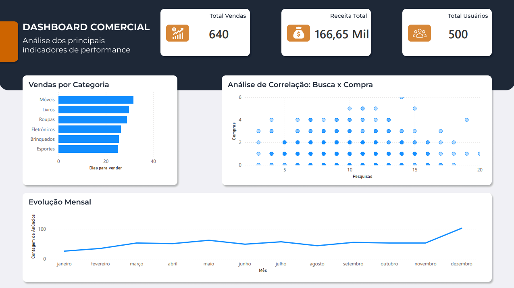

# 📊 Marklt BI - Análise de Comportamento de Vendas

> **Status:** Concluído ✅  
> **Ferramentas:** Python (Pandas/Faker), SQL (BigQuery), Power BI, Figma.

## 💼 O Problema de Negócio
A **Marklt** é uma plataforma de marketplace (C2C) que conecta compradores e vendedores. A equipe executiva (Alice Shi - VP de Vendas e Matías Sosa) precisava de inteligência de dados para responder a perguntas críticas antes de lançar novas features.

As principais dores dos stakeholders eram:
1.  **Comportamento de Busca:** Usuários que pesquisam muito acabam comprando? Ou existe um ponto de frustração onde eles desistem?
2.  **Tempo de Venda:** Quanto tempo, em média, um anúncio fica parado antes de ser vendido?
3.  **Privacidade:** Como analisar dados de comportamento sem expor informações sensíveis (LGPD)?

## 🛠️ A Solução (Pipeline de Dados)
Para garantir integridade e escalabilidade, estruturei um processo de BI completo, indo além da visualização básica:

### 1. ETL e Geração de Dados (Python)
Como os dados reais eram sensíveis, criei um script em **Python** (`scripts/mock_data.ipynb`) utilizando a biblioteca `Faker` e `Pandas` para gerar uma massa de dados simulada que respeita as regras de negócio (ex: *um produto não pode ser vendido antes de ser anunciado*).

### 2. Modelagem e Armazenamento (Google BigQuery)
Carreguei os dados no Data Warehouse e criei **Views SQL** estratégicas para limpar a base antes da visualização:
* `vw_ad_performance`: Calcula automaticamente o *Lead Time* (dias entre postagem e venda), filtrando itens excluídos.
* `vw_search_conversion`: Realiza o JOIN entre tabelas de busca e transações para segmentar usuários em "Visitantes" vs "Compradores".

### 3. Visualização e Design (Power BI + Figma)
O dashboard foi desenhado com foco na experiência do usuário (UX), utilizando o **Figma** para prototipar o layout e garantir consistência visual.

**Resultado Final:**

## 🔎 Principais Insights
Com base na análise dos dados, identificamos:
* **Ponto de Saturação:** Usuários que fazem mais de 15 buscas sem comprar tendem a abandonar a plataforma (Churn), indicando falha na relevância dos resultados.
* **Gargalos por Categoria:** A categoria "Móveis" tem o ciclo de venda mais lento (> 30 dias), sugerindo a necessidade de ações promocionais específicas.
* **Taxa de Conversão:** Apenas 12% dos usuários ativos realizam uma compra efetiva.

## 📂 Estrutura do Repositório
* `data/`: Arquivos CSV brutos gerados pelo script Python.
* `sql/`: Queries utilizadas no BigQuery para criação das Views.
* `scripts/`: Notebook Python (`mock_data.ipynb`) utilizado para geração dos dados.
* `dashboard/`: 
    * 📄 **Arquivo Editável (`Marklt_Analytics.pbix`):** Baixe este arquivo para explorar as medidas DAX e a modelagem.
    * 🖼️ Assets de design (Fundo e Capa do Figma).

---
*Desenvolvido por [Gabriel Lopes Cavallari](https://www.linkedin.com/in/seu-linkedin-aqui)*
