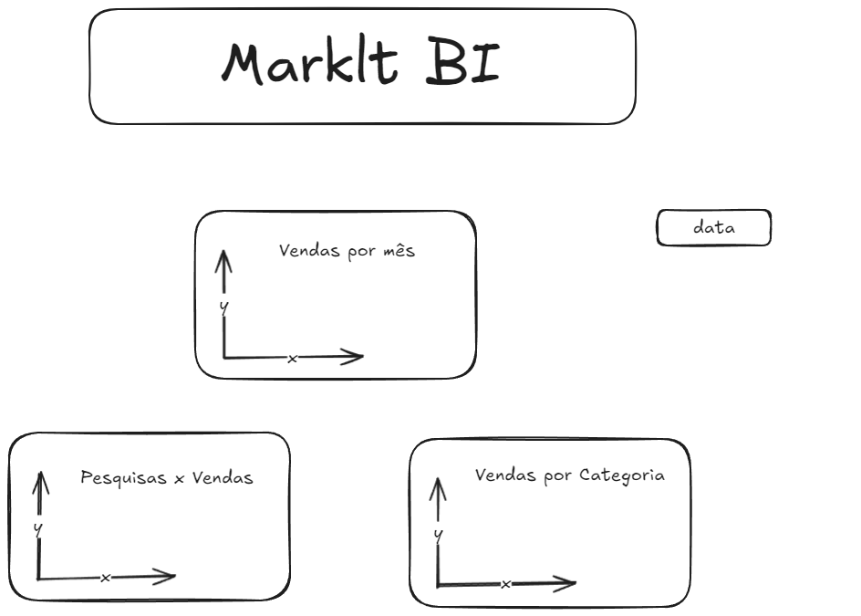

# 📊 Marklt BI - Análise de Comportamento de Usuário

> **Status do Projeto:** 🟡 Em Andamento (Fase de Planejamento & Estratégia Concluída)

## 📖 Sobre o Projeto
Este projeto visa analisar o comportamento de compradores e vendedores na plataforma **Marklt**, um marketplace de itens usados. O objetivo principal é utilizar dados para entender a jornada do usuário, identificar pontos de fricção e fornecer insights para a equipe de design otimizar a plataforma e aumentar as vendas.

Este projeto faz parte do portfólio desenvolvido durante o **Google Data Analytics Professional Certificate**, simulando um cenário real de Business Intelligence.

## 🎯 O Problema de Negócio
A equipe executiva da Marklt (Vice-Presidente de Vendas e Gerente de Programa) precisa responder a perguntas críticas antes de lançar novas funcionalidades:
- Como os usuários interagem com a plataforma hoje?
- Qual a correlação entre termos de pesquisa e a concretização de uma venda?
- Quanto tempo um anúncio fica online antes de ser vendido?

## 📂 Entregáveis e Documentação
Nesta etapa inicial, atuei como Analista de BI responsável pelo levantamento de requisitos e estratégia de dados.

| Documento | Descrição |
| :--- | :--- |
| [Stakeholder Requirements](docs/Stakeholder_Requirements.pdf) | Mapeamento das necessidades de Alice Shi e Matías Sosa, incluindo KPIs principais. |
| [Project Requirements](docs/Project_Requirements.pdf) | Definição de critérios de sucesso (SMART), restrições técnicas e cronograma. |
| [Strategy Document](docs/Strategy_Document.pdf) | Planejamento dos dashboards, definição de métricas e escolha visual dos gráficos. |

### 🧠 Destaques da Análise
Durante o planejamento, identifiquei lacunas críticas nas informações fornecidas e estabeleci planos de ação proativos:
* **Mapeamento de Jornada:** Proposta de entrevistas adicionais para desenhar o fluxo atual ("As-Is") vs. ideal ("To-Be").
* **Compliance:** Inclusão de verificação de LGPD/Privacidade para tratamento de UserIDs.
* **Estratégia Visual:** Definição de **Gráficos de Dispersão** (Scatter Plots) para analisar correlações complexas entre *volume de pesquisa* e *conversão de vendas*, indo além de contagens simples.

## 🎨 Dashboard Mockup
Esboço de baixa fidelidade criado para alinhar expectativas com os stakeholders antes do desenvolvimento técnico.

*(Ferramenta utilizada: Excalidraw no Obsidian)*

## 🛠 Ferramentas Utilizadas
* **Planejamento:** Google Docs / PDF
* **Design & Wireframing:** Obsidian Canvas & Excalidraw
* **Próximos Passos (Tech Stack):** SQL (BigQuery) e Tableau/PowerBI.

## 🚀 Próximos Passos
- [ ] Criação do Dataset simulado (Vendas e Pesquisas).
- [ ] Desenvolvimento das queries SQL para extração e limpeza (ETL).
- [ ] Construção do Dashboard interativo final.

---
*Desenvolvido por Gabriel Lopes Cavallari*
